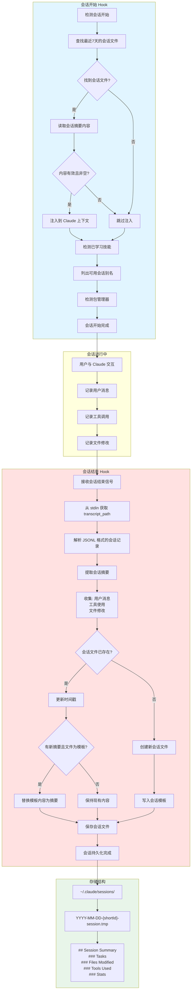
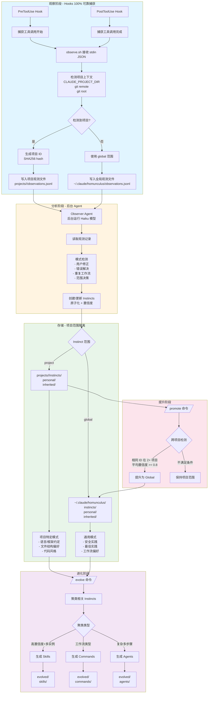
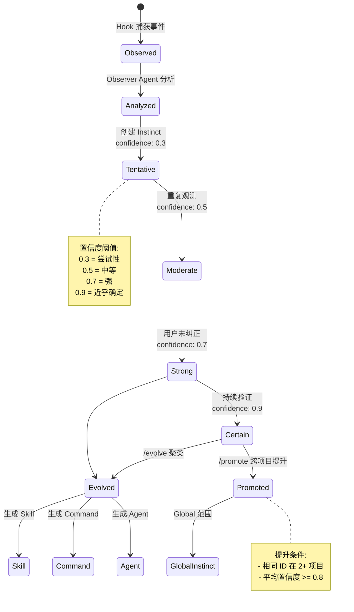

# Everything Claude Code 技术架构文档

## 目录
- [1. 上下文持久记忆系统](#1-上下文持久记忆系统)
- [2. 自动学习系统 v2.1](#2-自动学习系统-v21)
- [3. 技术实现细节](#3-技术实现细节)
- [4. 数据结构](#4-数据结构)

---

## 1. 上下文持久记忆系统

### 1.1 系统概述

上下文持久记忆系统通过 **Hooks 机制** 在会话开始和结束时自动保存和加载会话上下文，确保跨会话的连续性。

### 1.2 流程图



### 1.3 关键组件

| 组件 | 文件 | 功能 |
|------|------|------|
| SessionStart Hook | `scripts/hooks/session-start.js` | 会话开始时加载历史上下文 |
| SessionEnd Hook | `scripts/hooks/session-end.js` | 会话结束时提取并保存摘要 |
| Utils | `scripts/lib/utils.js` | 跨平台工具函数 |

---

## 2. 自动学习系统 v2.1

### 2.1 系统概述

Continuous Learning v2.1 是一个基于 **Instinct（本能）** 的学习系统，通过 Hooks 100% 可靠地捕获会话活动，创建具有置信度评分的原子化模式，并支持项目范围的隔离。

### 2.2 核心流程图



### 2.3 项目检测流程

```mermaid
flowchart TD
    A[开始项目检测] --> B{CLAUDE_PROJECT_DIR<br/>环境变量存在?}
    B -->|是| C[使用环境变量路径]
    B -->|否| D{在 Git 仓库中?}
    D -->|是| E[git rev-parse --show-toplevel]
    D -->|否| F[返回 global]

    E --> G{git remote get-url origin<br/>成功?}
    G -->|是| H[使用 remote URL<br/>作为 hash 源]
    G -->|否| I[使用仓库路径<br/>作为 hash 源]

    H --> J[SHA256 hash[:12]]
    I --> J

    C --> K[计算项目 ID]
    J --> K

    K --> L[创建项目目录结构]
    L --> M["projects/<id>/<br/>  observations.jsonl<br/>  instincts/<br/>    personal/<br/>    inherited/<br/>  evolved/<br/>    skills/<br/>    commands/<br/>    agents/"]

    M --> N[更新 projects.json 注册表]
    N --> O[返回项目信息]

    style A fill:#e1f5ff
    style F fill:#ffe1e1
    style M fill:#e8f5e9
```

### 2.4 Instinct 生命周期



---

## 3. 技术实现细节

### 3.1 会话持久化实现

#### JSONL 解析逻辑

```javascript
// session-end.js 核心解析逻辑
function extractSessionSummary(transcriptPath) {
  const lines = content.split('\n').filter(Boolean);
  const userMessages = [];
  const toolsUsed = new Set();
  const filesModified = new Set();

  for (const line of lines) {
    const entry = JSON.parse(line);

    // 收集用户消息
    if (entry.type === 'user' || entry.role === 'user') {
      const text = extractText(entry.message?.content ?? entry.content);
      if (text.trim()) {
        userMessages.push(text.slice(0, 200)); // 前 200 字符
      }
    }

    // 收集工具使用
    if (entry.type === 'tool_use') {
      toolsUsed.add(entry.tool_name);
      if (entry.tool_name === 'Edit' || entry.tool_name === 'Write') {
        filesModified.add(entry.tool_input?.file_path);
      }
    }
  }

  return {
    userMessages: userMessages.slice(-10),    // 最后 10 条
    toolsUsed: Array.from(toolsUsed).slice(0, 20),
    filesModified: Array.from(filesModified).slice(0, 30)
  };
}
```

### 3.2 Instinct 观察捕获

#### observe.sh 工作流程

```bash
# 1. 接收 stdin JSON
INPUT_JSON=$(cat)

# 2. 项目检测 (从 cwd 字段)
STDIN_CWD=$(echo "$INPUT_JSON" | python3 -c '...')
if [ -n "$STDIN_CWD" ]; then
  export CLAUDE_PROJECT_DIR="$STDIN_CWD"
fi

# 3. 调用 detect-project.sh
source "${SKILL_ROOT}/scripts/detect-project.sh"
# 设置: PROJECT_ID, PROJECT_NAME, PROJECT_DIR

# 4. 解析并写入观测
echo "$PARSED" | python3 -c "
observation = {
    'timestamp': timestamp,
    'event': 'tool_start' / 'tool_complete',
    'tool': tool_name,
    'project_id': PROJECT_ID,
    'project_name': PROJECT_NAME
}
print(json.dumps(observation))
" >> "$OBSERVATIONS_FILE"
```

### 3.3 项目 ID 生成算法

```python
# instinct-cli.py
def detect_project() -> dict:
    # 1. 环境变量优先
    env_dir = os.environ.get("CLAUDE_PROJECT_DIR")
    if env_dir and os.path.isdir(env_dir):
        project_root = env_dir

    # 2. git 仓库检测
    if not project_root:
        result = subprocess.run(
            ["git", "rev-parse", "--show-toplevel"],
            capture_output=True, text=True, timeout=5
        )
        if result.returncode == 0:
            project_root = result.stdout.strip()

    # 3. 获取 remote URL (跨机器一致性)
    try:
        result = subprocess.run(
            ["git", "-C", project_root, "remote", "get-url", "origin"],
            capture_output=True, text=True, timeout=5
        )
        remote_url = result.stdout.strip()
    except:
        remote_url = ""

    # 4. 生成项目 ID
    hash_source = remote_url if remote_url else project_root
    project_id = hashlib.sha256(hash_source.encode()).hexdigest()[:12]

    return {
        "id": project_id,
        "name": os.path.basename(project_root),
        "root": project_root,
        "remote": remote_url
    }
```

### 3.4 Instinct 格式

```yaml
---
id: prefer-functional-style
trigger: "when writing new functions"
confidence: 0.7
domain: "code-style"
source: "session-observation"
scope: project
project_id: "a1b2c3d4e5f6"
project_name: "my-react-app"
---

# Prefer Functional Style

## Action
Use functional patterns over classes when appropriate.

## Evidence
- Observed 5 instances of functional pattern preference
- User corrected class-based approach to functional on 2025-01-15
```

---

## 4. 数据结构

### 4.1 目录结构

```
~/.claude/homunculus/
├── identity.json              # 用户配置文件
├── projects.json              # 项目注册表
├── observations.jsonl         # 全局观测 (回退)
├── instincts/
│   ├── personal/             # 全局自动学习的 instincts
│   └── inherited/            # 全局导入的 instincts
├── evolved/
│   ├── agents/               # 全局生成的 agents
│   ├── skills/               # 全局生成的 skills
│   └── commands/             # 全局生成的 commands
└── projects/
    ├── a1b2c3d4e5f6/         # 项目哈希
    │   ├── observations.jsonl
    │   ├── observations.archive/
    │   ├── instincts/
    │   │   ├── personal/     # 项目特定自动学习
    │   │   └── inherited/    # 项目特定导入
    │   └── evolved/
    │       ├── skills/
    │       ├── commands/
    │       └── agents/
    └── f6e5d4c3b2a1/         # 另一个项目
        └── ...
```

### 4.2 观测记录格式 (JSONL)

```json
{"timestamp": "2025-01-15T10:30:00Z", "event": "tool_start", "tool": "Edit", "input": "{\"file_path\":\"src/App.tsx\",...}", "session": "abc123", "project_id": "a1b2c3d4e5f6", "project_name": "my-app"}
{"timestamp": "2025-01-15T10:30:01Z", "event": "tool_complete", "tool": "Edit", "output": "Successfully updated...", "session": "abc123", "project_id": "a1b2c3d4e5f6", "project_name": "my-app"}
```

### 4.3 项目注册表格式

```json
{
  "a1b2c3d4e5f6": {
    "name": "my-react-app",
    "root": "/path/to/project",
    "remote": "https://github.com/user/my-react-app.git",
    "last_seen": "2025-01-15T10:30:00Z"
  }
}
```

---

## 5. 命令参考

### 5.1 Instinct 命令

| 命令 | 描述 |
|------|------|
| `/instinct-status` | 显示所有 instincts (项目 + 全局) 及置信度 |
| `/evolve` | 聚类相关 instincts 为 skills/commands |
| `/instinct-export` | 导出 instincts 到文件 |
| `/instinct-import <file>` | 从文件或 URL 导入 instincts |
| `/promote [id]` | 将项目 instincts 提升为全局范围 |
| `/projects` | 列出所有已知项目及其 instinct 数量 |

### 5.2 配置选项

```json
{
  "version": "2.1",
  "observer": {
    "enabled": false,
    "run_interval_minutes": 5,
    "min_observations_to_analyze": 20
  }
}
```

---

## 6. 版本对比

### v2.1 vs v2.0 vs v1

| 特性 | v1 | v2.0 | v2.1 |
|------|----|----|----|
| **观测机制** | Stop hook | PreToolUse/PostToolUse | PreToolUse/PostToolUse |
| **观测可靠性** | ~50-80% | 100% | 100% |
| **分析方式** | 主上下文 | 后台 Agent (Haiku) | 后台 Agent (Haiku) |
| **粒度** | 完整 Skills | 原子 "Instincts" | 原子 "Instincts" |
| **置信度** | 无 | 0.3-0.9 加权 | 0.3-0.9 加权 |
| **存储** | 全局 | 全局 | **项目范围 + 全局** |
| **跨项目污染** | 是 | 是 | **否 (默认隔离)** |
| **提升机制** | 无 | 无 | **项目 → 全局** |
| **项目检测** | 无 | 无 | **git remote / path** |

---

## 7. 隐私与安全

- 观测记录保持在**本地**机器
- 项目范围的 instincts 按项目隔离
- 只有 **instincts**（模式）可以导出，不包含原始观测
- 不共享实际代码或对话内容
- 用户控制导出和提升的内容

---

*文档版本: 1.0*
*生成时间: 2025-03-02*
*基于: Everything Claude Code v1.7.0*
